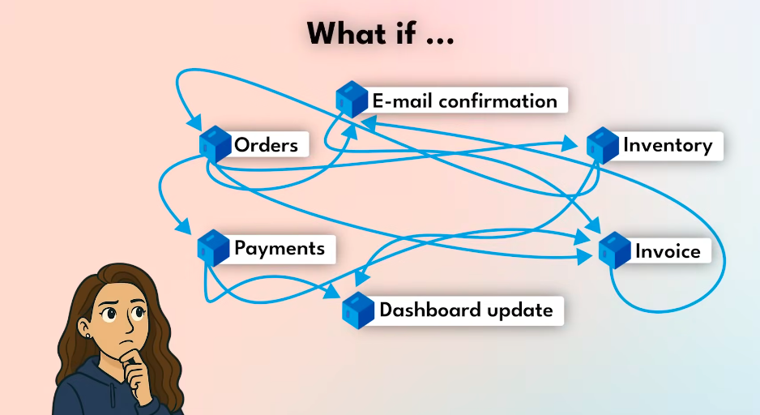
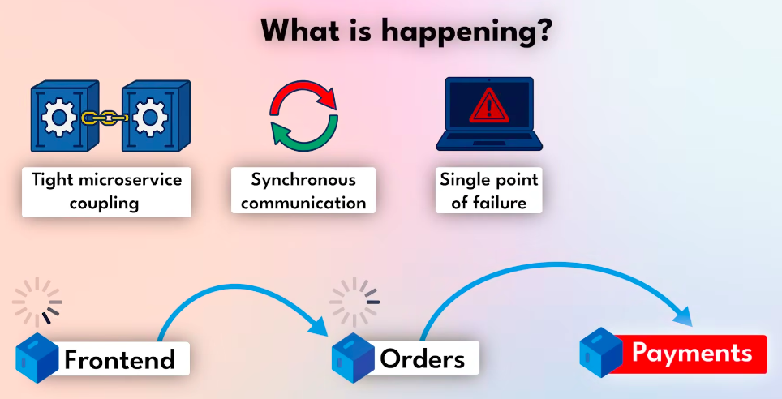
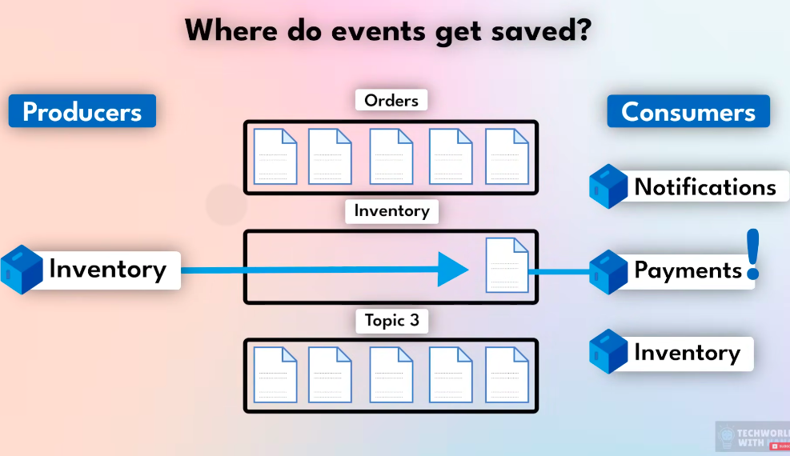

## Kafka -> Micro Service Management

- Lets assume we have so many micro services like `orders`, `e-mail confirmation`, `payments`, `invoice` etc

- Then those will are dependend on each other and if a single service crashes the whole application crashes
- Also if a single service is slow the entire process will be slow.

- Now the Kafka will play the main role in between the services and act like a broker.

- for example the orders now will send the event(key-value pairs and some metadata) to the kafka and doesn't wait for the response, it continues it's works.
- And kafka will take care to deliver the event to other micro services and if any service fails it will retry until it gives a valid response.

## Where do Events will Save

- Unlike saving the events as a dumpyard kafka organizes them logically with topics like

eg: Orders, inventory, etc the developer will give the topic names and it will organize the events.

- There will be some producers and subscribers (consumers) -> Producer services will produce an event and that event will be stored in topics and the consumers who subscribed those topics will get those events.

# How it works

## What is Apache Kafka?
At its core, **Apache Kafka** is a distributed event streaming platform. Think of it as a high-speed, digital "nervous system" that allows different applications to talk to each other by sending and receiving messages (events) in real-time.

Unlike a traditional database that stores "states" (like a bank balance), Kafka stores **events** (like the individual transactions that led to that balance).

---

## Core Components
Kafka works using a **Pub-Sub (Publish-Subscribe)** model. Here are the main players:

| Component | Simple Definition |
| :--- | :--- |
| **Producer** | The "sender." Applications that create and send data to Kafka. |
| **Consumer** | The "receiver." Applications that read and process data from Kafka. |
| **Topic** | A "folder" or category used to organize messages (e.g., "User-Signups"). |
| **Broker** | A server where Kafka runs. A collection of brokers forms a **Cluster**. |

---

## How it Scales: The "Partition" Secret
If a topic gets too large for one server to handle, Kafka breaks it down into **Partitions**.

* **Parallelism:** By splitting a topic into 10 partitions, you can have 10 different consumers reading data at the exact same time. This is why Kafka is so fast.
* **Order:** Inside a single partition, messages stay in the exact order they arrived.
* **Storage:** Partitions are spread across different brokers. If one server fills up, you just add another broker and move some partitions to it.

---

## How it Handles Event Surges
When a massive spike of data occurs (like a Black Friday sale), Kafka handles it through:

1.  **Buffering:** Kafka writes data to a disk-based "commit log" immediately. If consumers are too slow, the data just waits safely on the disk until the consumers catch up.
2.  **Consumer Groups:** You can group multiple consumers together. Kafka will automatically split the load so that each consumer handles a different partition.
3.  **Horizontal Scaling:** If the surge is permanent, you simply add more **Brokers** (for more storage/throughput) and more **Consumers** (to process data faster).

---

## Summary: How it Works
1.  **Producers** send events to a specific **Topic**.
2.  Kafka splits that topic into **Partitions** and stores them across multiple **Brokers**.
3.  **Consumers** subscribe to the topic and pull data at their own pace.
4.  Each message has a unique ID called an **Offset**, so consumers know exactly where they left off.

How familiar are you with distributed systems, or is this your first time diving into this kind of architecture?